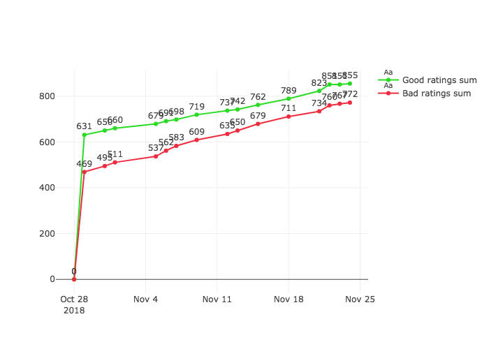

## Confluent documentation community ratings

### What is this anyway?

Plot below presents simple sum of ratings given by users on [Confluent Documentation site](https://docs.confluent.io/current/).

Just presenting community feedback for Confluent docs 😄

### Why have you done it?

Recently I've been using Kafka Streams for my own project together with Kafka Connect. 
Having good experience with Kafka documentation previously (still thinking it's great) I've jumped into [Confluent documentation](https://docs.confluent.io/current/) to use some more tools.

But to my shock almost every doc page seemed incomplete or just empty. And the ratings at some sites seemed to be incredibly negative!

Some time later I've meet Confluent people at a conference and they said:

**- Go and check out confluent platform, it has a great documentation, so everything will be as easy as it might be!"**

So I decided to see how good confluent documentation is based on people opinions and draw it as a simple chart 😗

### How it's run

It's just a single cron running on my computer, that calculates sum of all rating (positive/negative) on all Confluent Docs sites. Then draw simple diagram but keeps all the data near, so that more detailed diagrams could be created.

Go and see all data gathered in form of CSV if you're interested:

[data gathered](https://github.com/gmiejski/confluent-documentation-quality/tree/master/data)

### PS.

I'm definately now saying `don't use confluent platform!!!!`. Still thinking this is a great tool. It is coming from curiosity simply 😝.

ps2 not taking responsability if some pages did not get counted in single calculation - just omitting single page parsing errors, because why not 😝
